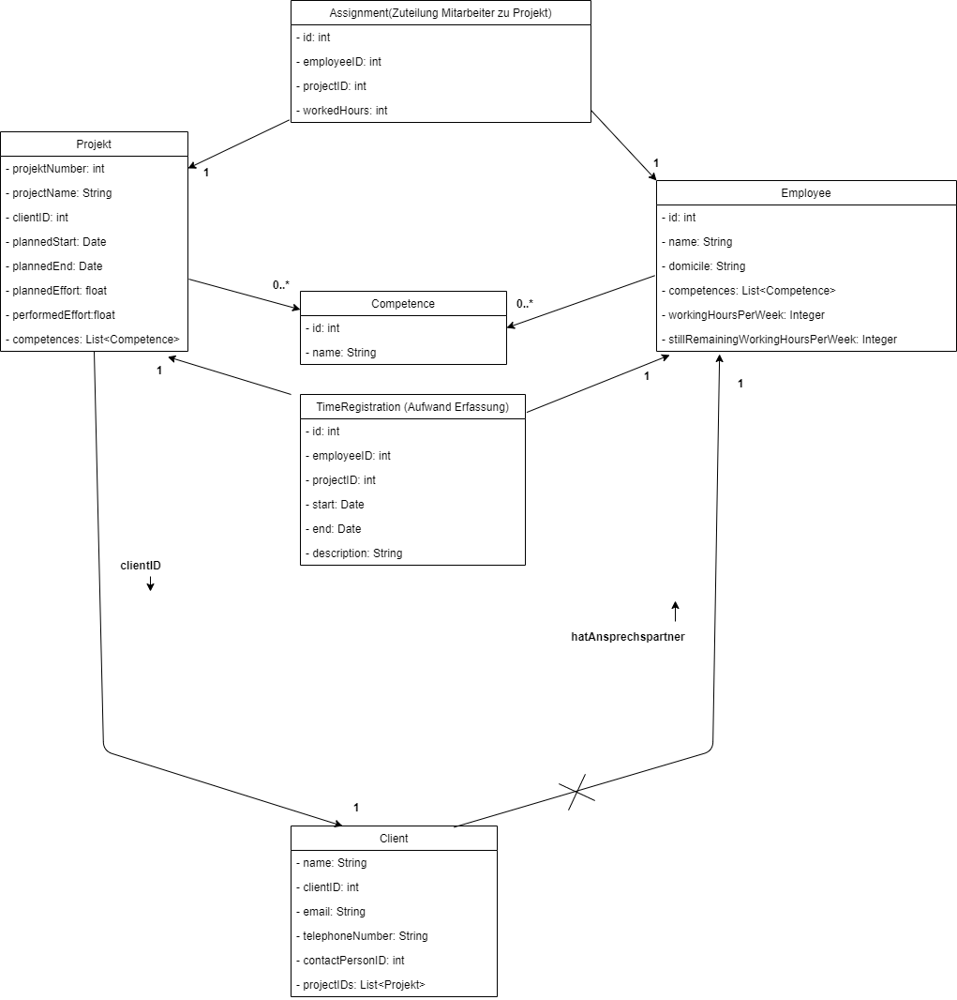
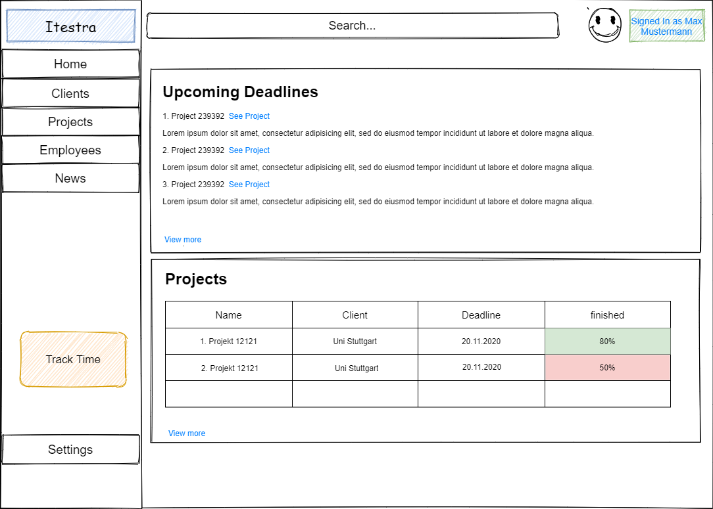
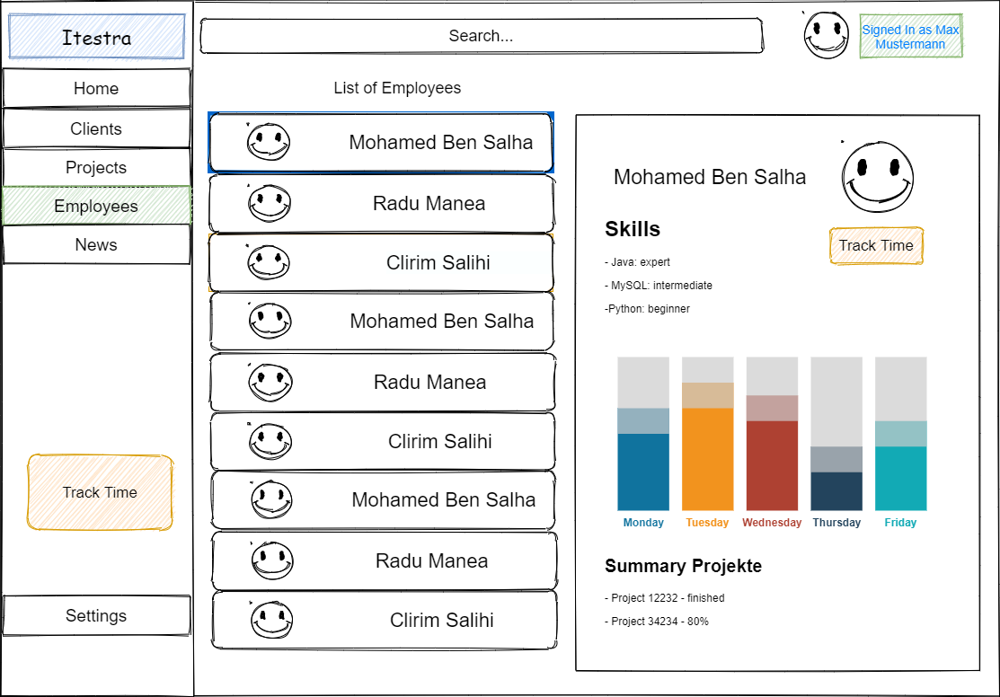

# Entwurf
## WebApp zur Aufwandserfassung und Projektsteuerung
Die WebApp ist als Single Page de.unistuttgart.sopra.Application aufgebaut. Die Daten werden in einer Datenbank gespeichert. Um die Daten zu manipulieren, wird eine Spring-Boot RESTApi angeboten. Diese kommuniziert mit der Datenbank und kann über einen OR-Mapper die Daten schnell und zuverlässig manipulieren. Auf der Frontend Seite wird mit Vue.js die Single Page de.unistuttgart.sopra.Application dargestellt. Die Daten werden dann dynamisch geholt.

### Gruppe 12
- Clirim Salihi
- Mohamed Ben Salha
- Radu Manea

## Inhaltsverzeichnis
1. System Context Diagram
2. UML Domain Model
3. Beschreibung der Top Packages der API
4. Beschreibung der Frontend-Views
5. GUI-Skizzen (handschriftlich und digital)

## 1.) Context Diagram

## 2.) UML Domain Model

## 3.) Beschreibung der Java-Packages der API

- **Entities:** in diesem Package werden alle Entitäten gespeichert, wie zum Beispiel Mitarbeiter, Kunde oder Projekt.
- **Authentication:** in diesem Package werden der ganze Code sein, der sich um die sichere Authentifizierung des Mitarbeiters kümmert
- **Database methods:** hier werden die ganzen Hilfsmethoden sein, die für die Manipulation der Daten genutzt werden. Die Methoden um aus der Datenbank zu lesen, etwas zu ändern oder etwas zu löschen sind hier dabei.
- **Calculation methods:** die Hilfsmethoden für die Rechnung mit Personenstunden und für die verschiedenen Berechnungen mit Zeit werden hier gespeichert
- **Controllers(API):** hier werden die Rest Funktionen für das Mapping von Requests geschrieben

## 4.) Beschreibung der Frontend-Views

- **Homeview:** nachdem man sich angemeldet hat, kommt man zu der Homeview. Von hier kann überall hin navigieren. In der Mitte sieht man Blöcke, die alle wichtige Informationen übersichtlich darstellen. Beim Header ist eine Suchleiste und auf der linken Seite ist das Menü, womit man zu allen anderen Views navigieren kann.
- **Kundenliste:** Hier wird man eine Liste mit allen Kunden der Firma sehen. Pro Kunde wird der Name und eine ID zu sehen sein.Die Searchbar oben und das Menü links bleiben gleich wie bei der Homeview. Auf der rechten Seite neben der Liste gibt es ein Preview window, wo man ausführliche Informationen zu einem Kundesehen kann. In dieser View kann man einen neuen Kunden hinzufügen, bereits existierende Kunden bearbeiten oder Kunden löschen.
- **Projektliste:** Hier wird man eine Liste mit allen Projekten der Firma sehen. Pro Projekt wird der Name, eine ID, eine geplanteDeadline und eine voraussichtliche Deadline zu sehen sein. Die Searchbar oben und das Menü links bleiben gleich wie bei der Homeview. Auf der rechten Seite neben der Liste gibt es ein Preview window, wo man ausführliche Informationen zu einem Projektsehen kann. In dieser View kann man ein neues Projekt erstellen, bereits existierende Projekte bearbeiten oder Projekte löschen.
- **Mitarbeiterliste:** Hier wird man eine Liste mit allen Mitarbeiter der Firma sehen. Pro Mitarbeiter wird der Name und eine ID  zu sehen sein. Die Searchbar oben und das Menü links bleiben gleich wie bei der Homeview. Auf der rechten Seite neben der Liste gibt es ein Preview window, wo man ausführliche Informationen zu einem Mitarbeiter sehen kann. In dieser View kann man einen neuen Mitarbeiter erstellen, bereits existierende Mitarbeiter bearbeiten oder Mitarbeiter löschen.
- **Zeiterfassung Mitarbeiter:** Für die Zeiterfassung bleiben das Menu links und die Searchbar oben gleich. In der Mitte hat man dann die Textboxen sowie Knöpfe, um den Aufwand zu erfassen. Wenn man einen Mitarbeiter aussucht, wird eine Liste mit den vergangenen Aufwänden des Mitarbeiters angezeigt.

## 5.) GUI-Skizzen
### GUI-Skizze: Home-View

### GUI-Skizze: Mitarbeiter-View

